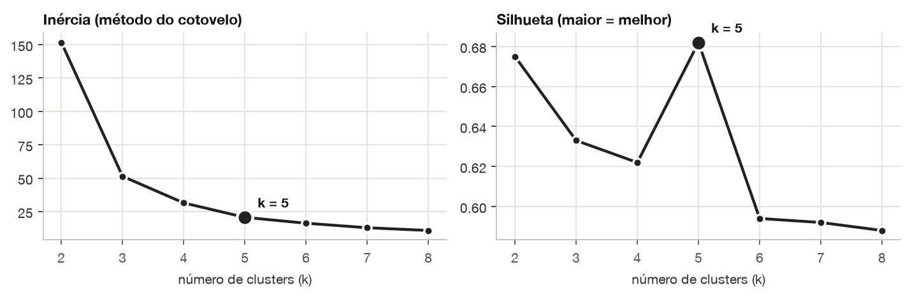
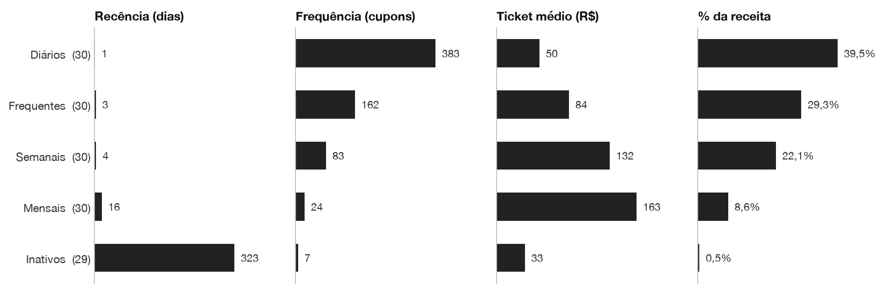
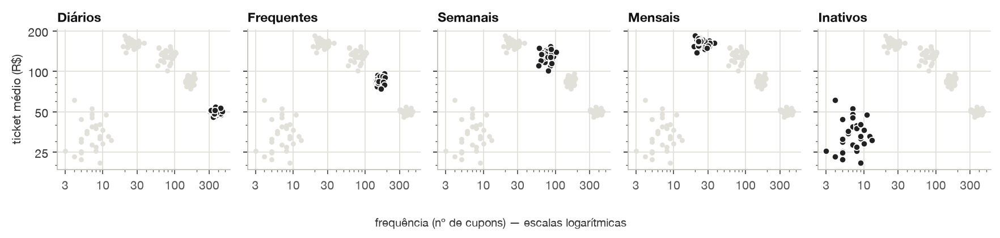

<header class="cabecalho">
<p class="instituicao">Instituto Federal de Goiás (IFG)</p>
<p class="programa">Pós-Graduação em Inteligência Artificial Aplicada</p>
<p class="titulo">Relatório Técnico — Clusterização de Clientes e Regras de Associação</p>
<p class="disciplina">Tópicos 1 — Business Intelligence · Trabalho 2 · Outubro de 2026</p>
<p class="pessoas"><strong>Professor:</strong> Sirlon Diniz de Carvalho<br><strong>Alunos:</strong> Guilherme Alves Martins e Daniel Flávio de Oliveira</p>
</header>

# 1. Objetivo

Aplicar **aprendizagem por conjuntos (ensemble)** sobre o DW Organizacional construído no Trabalho 1:

1. **segmentar os clientes** pelo comportamento de compra (RFM + K-Means);
2. **descobrir regras de associação entre produtos dentro de cada segmento** (Apriori).

A motivação é simples: regras extraídas de todas as vendas de uma vez tendem a ser genéricas e dominadas pelo cliente mais comum. Segmentando primeiro, cada grupo revela os seus próprios padrões, e cada padrão já vem com o público a quem se destina.

| Entregável | Arquivo |
|---|---|
| Código (análise) | `notebook/clusterizacao_regras.ipynb` |
| DataMart para o fim (DDL e carga) | `DW_Docker/ddl/03_dm_crm.sql`, `DW_Docker/etl/07_dm_crm.sql` |
| Povoamento do BD | `DW_Docker/fontes/02_mercearia_movimento.sql` |
| Ambiente | `DW_Docker/docker-compose.yml`, `requirements.txt` |

# 2. Escopo: por que só a base Mercearia

O DW integra duas fontes, mas a análise usa apenas a **Mercearia** (varejo). A **Northwind** foi avaliada e descartada pelos motivos abaixo:

| Critério | Northwind (B2B) | Mercearia (varejo) |
|---|---|---|
| Pedidos / clientes / produtos | 830 / 89 / 77 | 19.638 / 149 / 30 |
| Itens por pedido | 2,6 | 3,1 |
| Par de produtos mais comum | 8 pedidos (1,0%) | 3.960 cupons (20,2%) |
| Silhueta do K-Means (melhor k) | 0,37 — sem grupos naturais | 0,68 |

Na Northwind, os pedidos são reposições de estoque de distribuidores. São poucos itens por pedido, num catálogo grande, e as combinações quase não se repetem: nenhum par de produtos chega a 1% dos pedidos. Subindo para o nível de categoria também não há associação, pois nenhum dos 28 pares de categorias tem lift acima de 1 (máx. 0,97). Com tão poucas coincidências, o Apriori ou não encontra nada ou "encontra" regras sustentadas por 1 ou 2 pedidos, que são acaso e não padrão. Além disso, os clientes formam um contínuo, sem grupos naturais. A técnica pressupõe cestas recorrentes, e esse é o cenário do varejo.

# 3. Dados

## 3.1 Povoamento do BD

O movimento de vendas original da Mercearia (Trabalho 1) sorteava cliente e produtos de forma **independente**. Assim, nenhuma cesta tinha padrão e qualquer regra sairia com lift ≈ 1. Para este trabalho, o script `fontes/02_mercearia_movimento.sql` foi reescrito: cada cliente recebe um **perfil de compra**, que define

- a **frequência** de visitas (com variação individual de ±20% e mais movimento em dezembro); e
- as **missões de compra**: cestas típicas que ocorrem em cada visita com certa probabilidade, sempre acompanhadas de itens avulsos (ruído).

| Perfil | Clientes | Visitas | Missões (exemplos) |
|----------|----:|------------|----------------------------|
| Café da manhã | 30 | ~3,5 por semana | pão + presunto; café + leite + biscoito; aveia + banana |
| Família com bebê | 30 | ~1,5 por semana | fralda + sabonete + leite; biscoito + suco + chocolate; pizza + refrigerante |
| Churrasco | 30 | ~0,75 por semana, sexta a domingo | picanha + cerveja + sal; cerveja + chips; tilápia + refrigerante |
| Compra do mês | 30 | ~1 por mês | arroz + feijão + óleo; macarrão + molho; detergente + sabonete; café + farinha |
| Ocasional | 29 | poucas, e pararam de comprar | itens de conveniência soltos |

O período vai de 01/10/2024 a 28/09/2026, com 19.638 cupons e 61.213 itens. O script é determinístico (`setseed`), então cada execução gera os mesmos dados. **O perfil não é carregado no DW:** ele fica só na tabela `gabarito_perfil` do banco de origem, usada no fim para validar se a clusterização o redescobriu.

## 3.2 DataMart `dm_crm`

Os DataMarts do Trabalho 1 agregam as vendas sem o cliente individual (minimização por LGPD) e por isso não servem aqui. Foi criado o DataMart **`dm_crm`**, carregado **somente a partir do schema `dw`**:

> Fontes → DW (`dw.fato_vendas`, `dw.dim_cliente`, `dw.dim_produto`) → **`dm_crm`** → notebook (K-Means + Apriori) → **`dm_crm`** (resultados)

| Tabela | Grão | Uso |
|--------------|------------|----------------------|
| `dim_cliente`, `dim_produto` | cliente / produto de negócio | consolidam as versões SCD2 do DW na versão atual |
| `fato_cesta` | 1 produto em 1 cupom | transações do Apriori |
| `fato_cliente_rfm` | 1 cliente | entrada do K-Means: recência, frequência, ticket médio |
| `cliente_cluster`, `regra_associacao` | cliente / regra | resultados, gravados pelo notebook |

A validação do ETL foi ampliada: a receita e o número de cupons do `dm_crm` precisam bater com o DW. Se não baterem, a carga é abortada. O cliente aparece só pela chave substituta e pelo pseudônimo do DW (ex.: `Cliente MC-00042`).

# 4. Método

## 4.1 Segmentação: RFM + K-Means

**RFM** descreve cada cliente por três números: **R**ecência (dias desde a última compra), **F**requência (nº de cupons) e **M**onetário. Como M usamos o **ticket médio**. O valor total seria praticamente F × ticket e repetiria a informação de F.

O **K-Means** agrupa clientes próximos no espaço R-F-M, por distância euclidiana. Por isso as variáveis passam por dois tratamentos:

1. **redução de assimetria**: raiz quadrada em R (assimetria moderada) e logaritmo em F e M (assimetria forte, com poucos clientes muito acima dos demais);
2. **padronização (z-score)**: média 0 e desvio 1, para nenhuma variável dominar a distância.

O número de grupos **k** foi escolhido entre 2 e 8 pelo **método do cotovelo** (inércia, a soma das distâncias ao centro do grupo) e pela **silhueta** (de −1 a 1: o quanto cada cliente está mais perto do próprio grupo que do vizinho). A regra foi a maior silhueta com k ≥ 3, porque k = 2 só separaria "bons" de "ruins".

## 4.2 Associação: Apriori

Cada cupom é uma **cesta**. O algoritmo **Apriori** encontra os conjuntos de produtos frequentes e, a partir deles, regras **A → B**, avaliadas por:

| Métrica | Significado | Limite usado |
|---|---|---|
| Suporte | % das cestas com A e B juntos | ≥ 5% (e ≥ 5 cestas) |
| Confiança | entre as cestas com A, % que também têm B | ≥ 40% |
| Lift | confiança ÷ % de cestas com B; 1 = acaso | ≥ 1,2 |

Usamos **pares** de produtos (A → B), que viram ação direta: "quem leva A recebe oferta de B". Como A → B e B → A têm o mesmo lift, mantemos só o sentido de maior confiança.

## 4.3 O ensemble

As mesmas regras foram mineradas **na base inteira** e **em cada cluster**, com os mesmos limites. A comparação mostra o que a segmentação acrescenta. Ferramentas: Python com `pandas`, `scikit-learn` (K-Means, silhueta), `mlxtend` (Apriori) e `matplotlib`.

# 5. Resultados

## 5.1 Clusters



Com **k = 5** a silhueta chega a **0,68**, o maior valor da faixa (acima até de k = 2) e um indicador de grupos bem separados. Os clusters foram numerados do mais ao menos frequente e nomeados pelo comportamento RFM. O RFM não sabe nada sobre produtos:



| Cluster | Clientes | Recência | Frequência | Ticket médio | % receita | Comportamento |
|--------|-----:|------:|------:|-------:|------:|------------------|
| Diários | 30 | 1 dia | 383 | R$ 49,90 | 39,5% | vêm quase todo dia, ticket baixo |
| Frequentes | 30 | 3 dias | 162,5 | R$ 84,20 | 29,3% | 1 a 2 vezes por semana |
| Semanais | 30 | 3,5 dias | 83 | R$ 131,60 | 22,1% | ~1 vez por semana, ticket alto |
| Mensais | 30 | 16,5 dias | 24,5 | R$ 162,80 | 8,6% | ~1 vez por mês, a maior compra |
| Inativos | 29 | 323 dias | 7 | R$ 32,90 | 0,5% | poucas compras, sumiram |



**Validação.** Cruzando os clusters com o gabarito, a **pureza foi de 100%**: os 149 clientes caíram no cluster correspondente ao seu perfil (Diários = Café da manhã, Frequentes = Família com bebê, Semanais = Churrasco, Mensais = Compra do mês, Inativos = Ocasional), sem o modelo nunca ter visto o perfil. O resultado é tão limpo porque os dados são simulados e os perfis bem separados. Com dados reais, a fronteira entre grupos seria mais difusa.

## 5.2 Regras: base inteira × por cluster

| Grupo | Cestas | Regras | Só no cluster | Regra de maior lift |
|----------|------:|-----:|--------:|------------------------------|
| Base inteira | 19.638 | 17 | — | Picanha → Cerveja (7,5) |
| Diários | 11.345 | 7 | 0 | Banana → Aveia (3,5) |
| Frequentes | 4.910 | 9 | 4 | Sorvete → Pizza congelada (3,2) |
| Semanais | 2.411 | 8 | 7 | Refrigerante → Tilápia (3,9) |
| Mensais | 760 | 7 | 7 | Farinha de trigo → Café (1,6) |
| Inativos | 212 | 0 | — | — |

Exemplos de regras por cluster (suporte / confiança / lift):

| Cluster | Regra | Sup. | Conf. | Lift |
|---|---|---:|---:|---:|
| Diários | Presunto → Pão francês | 32,6% | 90% | 1,63 |
| Diários | Biscoito → Café | 17,9% | 84% | 2,29 |
| Frequentes | Leite → Fralda | 26,0% | 86% | 1,89 |
| Frequentes | Suco de laranja → Biscoito | 28,0% | 81% | 2,13 |
| Semanais | Sal → Picanha | 33,6% | 94% | 1,66 |
| Semanais | Fósforo → Picanha | 22,6% | 90% | 1,58 |
| Mensais | Molho de tomate → Macarrão | 53,9% | 89% | 1,45 |
| Mensais | Vassoura → Detergente | 20,5% | 91% | 1,49 |

**O que a segmentação acrescentou:**

1. **A base inteira só enxerga o cliente dominante.** Os Diários geram 58% dos cupons, e 11 das 17 regras globais são da cesta de café da manhã deles. As 7 regras do cluster Diários já estavam na base inteira.
2. **18 regras só aparecem segmentando.** A compra de abastecimento dos Mensais está em apenas 4% dos cupons e não atinge o suporte mínimo na base inteira. Dentro do cluster, ela aparece inteira.
3. **O mesmo produto muda de parceiro.** O leite vai com café e pão nos Diários e com fralda e sabonete nos Frequentes. O sabonete vai com fralda nos Frequentes e com detergente nos Mensais. O refrigerante vai com pizza nos Frequentes e com tilápia nos Semanais.
4. **A base inteira cria regras falsas e infla o lift.** 4 das 17 regras globais (ex.: banana → pão, café → pão) não se confirmam em nenhum cluster. Os dois produtos são do mesmo tipo de cliente, mas de cestas diferentes. Pelo mesmo motivo, picanha → cerveja tem lift **7,5** na base inteira e **1,3** dentro dos Semanais: o valor global mede principalmente que os dois produtos são comprados pelo mesmo tipo de cliente, e não a afinidade entre eles.
5. **Confiança alta nem sempre é associação.** Nos Mensais, o arroz está em 85% das cestas. Ele é a base da compra, e por isso nenhuma regra com ele passa do lift 1,2: o máximo possível seria 1 ÷ 0,85 ≈ 1,18.
6. **Inativos não têm regras**, porque as cestas são pequenas e sem padrão.

## 5.3 Ações sugeridas

| Cluster | Ação |
|-------|--------------------------------|
| Diários | combo café da manhã (pão + presunto; café + leite + biscoito) |
| Frequentes | kit lanche infantil; oferta de fralda junto de leite e sabonete |
| Semanais | kit churrasco às sextas (picanha + sal + fósforo + cerveja) |
| Mensais | lista de compra do mês com delivery (massas + molho; limpeza) |
| Inativos | reativação (cupom de retorno), não venda cruzada |

# 6. Como executar

```bash
cd DW_Docker
docker compose up -d                 # PostgreSQL (porta 5434) + ETL até o dm_crm
docker compose logs etl              # conferir a validação da carga
cd ..
python3 -m venv .venv && .venv/bin/pip install -r requirements.txt
cd notebook && ../.venv/bin/jupyter notebook clusterizacao_regras.ipynb
```

O notebook lê o `dm_crm`, gera as figuras em `relatorio/figuras/` e grava os clusters e as regras de volta no banco.

# 7. Limitações

- **Dados simulados.** Os perfis foram embutidos no povoamento, por isso os clusters saem muito nítidos. O mérito da validação é mostrar que o pipeline **recupera** uma estrutura que de fato existe, sem tê-la visto. Em dados reais, a pureza seria menor.
- **RFM descreve comportamento, não preferência.** Aqui os dois andam juntos (cada perfil tem frequência e ticket próprios). Num cenário em que clientes com o mesmo RFM comprassem coisas diferentes, valeria acrescentar variáveis de mix de categorias.
- **Só pares de produtos.** Regras com mais itens ({pão, presunto} → leite) foram deixadas de fora, para manter a leitura simples.
- **Parâmetros fixos.** Os limites de suporte, confiança e lift foram definidos uma vez, para a base inteira e para os clusters. Clusters pequenos, como o de Inativos, ficam naturalmente sem regras.
